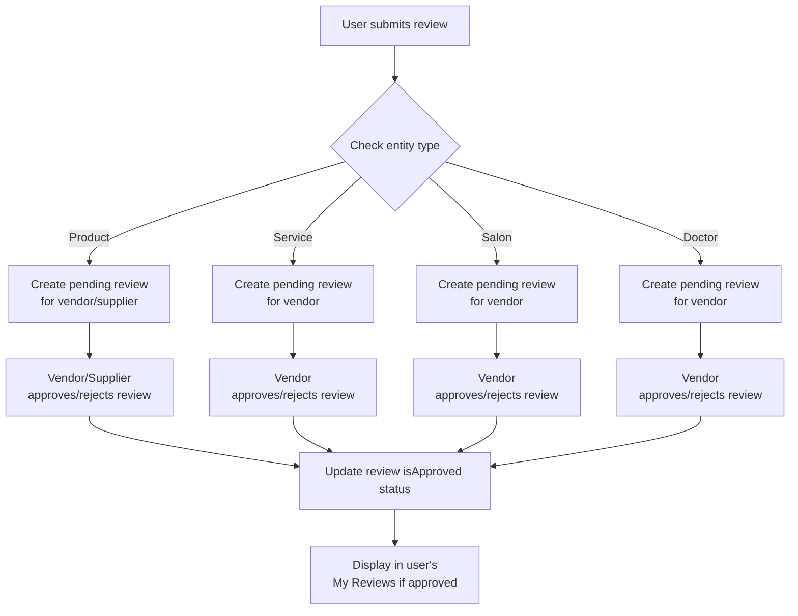

# Service and Salon Review Approval Workflow

This document describes the implementation of the review approval workflow for service and salon reviews, extending the existing workflow for product reviews.

## Overview

The review approval workflow ensures that all reviews submitted by users must be approved by the respective business owner (vendor or supplier) before appearing in the user's "My Reviews" section. This workflow now applies to:

1. Product reviews (already implemented)
2. Service reviews (newly implemented)
3. Salon reviews (already implemented)

## Workflow

## Implementation Details

### 1. Review Submission

All reviews are created with `isApproved: false` by default, regardless of entity type. This happens in the general reviews API endpoint at `/api/reviews`.

### 2. Review Display to Users

Users only see reviews in their "My Reviews" section when `isApproved: true`. This is enforced in the client reviews API endpoint at `/api/client/reviews`.

### 3. Review Management by Business Owners

Business owners (vendors, suppliers, doctors) can view, approve, reject, and delete reviews for entities they own through the CRM reviews API at `/api/crm/reviews`.

### 4. New Endpoints

#### Service Reviews Endpoint
- Path: `/api/services/reviews/[serviceId]`
- Method: GET
- Purpose: Fetch all approved reviews for a specific service
- Access: Public (no authentication required)

### 5. Updated Logic

#### CRM Reviews Fetching
Enhanced the CRM reviews API to handle service reviews for vendors, allowing them to see and manage reviews for their services.

#### Review Approval/Rejection
Updated the review approval endpoint to verify ownership of service reviews before allowing approval/rejection.

#### Review Deletion
Updated the review deletion endpoint to verify ownership of service reviews before allowing deletion.

## Entity Ownership Verification

Different entity types have different ownership verification mechanisms:

1. **Products**: Owned by vendors or suppliers. Verification checks that the product's `vendorId` matches the owner's ID.

2. **Services**: Owned by vendors. Verification checks that the service exists in the vendor's service collection.

3. **Salons**: Represented by the vendor entity itself. Verification checks that the salon ID matches the vendor's ID.

4. **Doctors**: Represented by the vendor entity itself. Verification checks that the doctor ID matches the vendor's ID.

## Database Schema

The Review model supports all entity types through the `entityType` field which can be one of:
- `product`
- `service`
- `salon`
- `doctor`

All reviews have an `isApproved` boolean field that defaults to `false`.

## Frontend Integration

To display service reviews on a service details page:
1. Call the service reviews API endpoint with the service ID
2. The endpoint will return only approved reviews
3. Display the reviews in the UI

To submit a service review:
1. Use the general reviews API endpoint at `/api/reviews`
2. Set `entityType` to "service" and `entityId` to the service ID
3. The review will be created with `isApproved: false` by default

## Testing

To test the service review workflow:
1. Submit a service review as a client user
2. Log in as the vendor who owns the service
3. Navigate to the CRM reviews section
4. Find the pending service review
5. Approve the review
6. Log back in as the client user
7. Check the "My Reviews" section to confirm the review is now visible