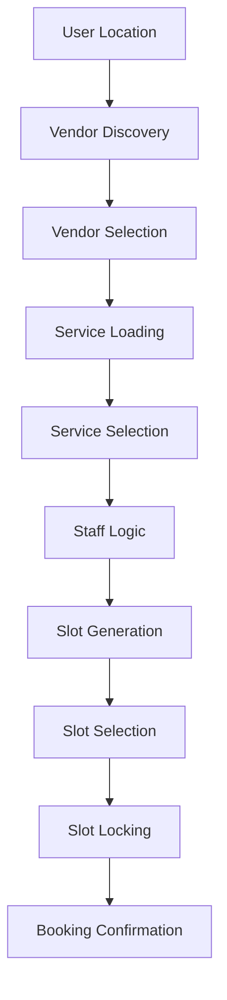

# Glowvita Booking System Architecture

## Overview

The Glowvita Booking System is a comprehensive, optimized solution for managing salon services, home services, and wedding packages. This document outlines the architecture, components, and workflows of the system.

## System Components

### 1. Unified API Layer

Located at `/api/booking`, this single endpoint handles all booking operations:

- **GET endpoints** for discovery (vendors, services, staff, slots, wedding packages)
- **POST endpoints** for creation operations (quotes, locks, confirmations, customizations)
- **PUT endpoints** for updates (wedding package modifications)
- **DELETE endpoints** for cancellations

### 2. Core Modules

#### Error Handling
- Centralized error management with custom error classes
- Consistent error response formatting
- Detailed error logging with context

#### Validation Engine
- Comprehensive data validation for all booking entities
- Real-time validation with detailed error reporting
- Support for services, staff, appointments, and wedding packages

#### Caching Layer
- Dual-layer caching with Redis (primary) and in-memory fallback
- Automatic cache invalidation
- Performance optimization for frequently accessed data

#### Database Optimization
- Index optimization for all major models
- Compound indexes for common query patterns
- Query performance monitoring

#### Scheduling Engine
- Fresha-like slot validation engine
- Staff availability checking
- Conflict detection and resolution
- Travel time integration

#### Optimistic Locking
- Concurrent booking protection
- Temporary appointment creation
- Lock expiration management

### 3. Models

#### Vendor Model
- Location-based discovery with geospatial indexing
- Support for different vendor types (salon-only, home-service, hybrid)
- Travel radius configuration

#### Service Model
- Dynamic service loading after vendor selection
- Category-based organization
- Home service and wedding service flags

#### Staff Model
- Availability management by day
- Break and blocked time handling
- Service compatibility mapping

#### Appointment Model
- Comprehensive booking information storage
- Status tracking (tentative, confirmed, cancelled)
- Lock token association

#### Wedding Package Model
- Enhanced package structure with customization support
- Service bundling with quantities
- Deposit and cancellation policy management

## Booking Flows

### 1. Salon Service Booking

1. **Location Detection**: System detects user location or accepts manual input
2. **Vendor Discovery**: Loads only salons serving the specified location
3. **Service Selection**: After vendor selection, loads all services for that vendor
4. **Staff Selection**: Shows available staff based on service compatibility
5. **Slot Generation**: Creates valid time slots considering:
   - Staff working hours
   - Existing appointments
   - Breaks and blocked times
   - Service duration requirements
6. **Slot Locking**: Acquires optimistic lock on selected slot
7. **Confirmation**: Finalizes booking with payment processing

### 2. Home Service Booking

1. **Location Collection**: Collects customer location for home services
2. **Travel Time Calculation**: Computes travel time using Google Maps API with Haversine fallback
3. **Buffer Addition**: Adds travel time buffers to slot generation
4. **Same workflow as salon booking** with additional travel considerations

### 3. Wedding Package Booking

1. **Package Discovery**: Loads available wedding packages from CRM
2. **Customization**: Allows adding/removing services and adjusting quantities
3. **Dynamic Pricing**: Recalculates price and duration based on customizations
4. **Team Assignment**: Ensures all required staff are available for package delivery
5. **Specialized Slot Generation**: Creates slots only when entire team is available

## Key Features

### Location-Based Discovery
- Geospatial indexing for efficient vendor lookup
- Radius-based filtering for home service providers
- Support for different vendor types (salon-only, home-service, hybrid)

### Intelligent Slot Generation
- Fresha-like validation engine ensuring realistic bookings
- Multi-staff coordination for wedding packages
- Travel time integration for home services
- Comprehensive conflict detection

### Staff Management
- "Any Staff" option with automatic assignment
- Service compatibility mapping
- Availability and scheduling management

### Performance Optimization
- Multi-layer caching strategy
- Database query optimization
- Batch processing where possible
- Lazy loading of non-critical data

### Error Handling & Validation
- Comprehensive input validation
- Graceful error recovery
- User-friendly error messages
- Detailed logging for debugging

## API Endpoints

### Discovery Endpoints
- `GET /api/booking/vendors` - Find vendors by location
- `GET /api/booking/services` - Load services for a vendor
- `GET /api/booking/staff` - Load staff for a vendor
- `GET /api/booking/slots` - Generate available time slots
- `GET /api/booking/wedding-packages` - Load wedding packages

### Booking Endpoints
- `POST /api/booking/quote` - Generate price and time quote
- `POST /api/booking/lock` - Acquire slot lock
- `POST /api/booking/confirm` - Confirm booking
- `POST /api/booking/customize-wedding-package` - Customize wedding package

### Management Endpoints
- `PUT /api/booking/wedding-package` - Update wedding package
- `DELETE /api/booking/booking` - Cancel booking

## Data Flow

## Caching Strategy

1. **Vendor Data**: Cached for 5 minutes
2. **Service Data**: Cached for 10 minutes
3. **Staff Data**: Cached for 10 minutes
4. **Slot Data**: Cached for 3 minutes
5. **Wedding Packages**: Cached for 10 minutes

## Error Recovery

- Graceful degradation when external services fail
- Fallback mechanisms for critical operations
- Automatic retry logic for transient failures
- Detailed error logging for troubleshooting

## Security Considerations

- Input validation and sanitization
- Rate limiting to prevent abuse
- Secure handling of sensitive data
- Authentication and authorization checks

## Monitoring & Logging

- Comprehensive logging of all booking operations
- Performance metrics collection
- Error rate monitoring
- User behavior analytics

## Future Enhancements

1. Machine learning for demand forecasting
2. Advanced recommendation engine
3. Integration with calendar systems
4. Mobile app synchronization
5. Advanced reporting and analytics